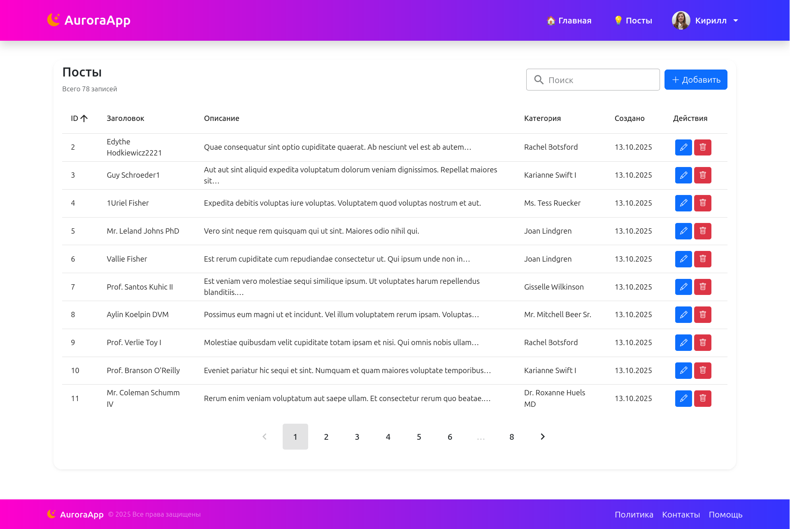
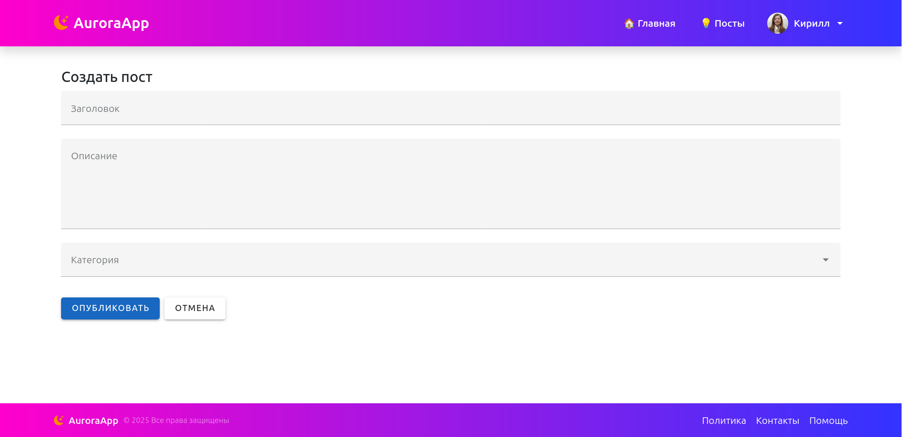
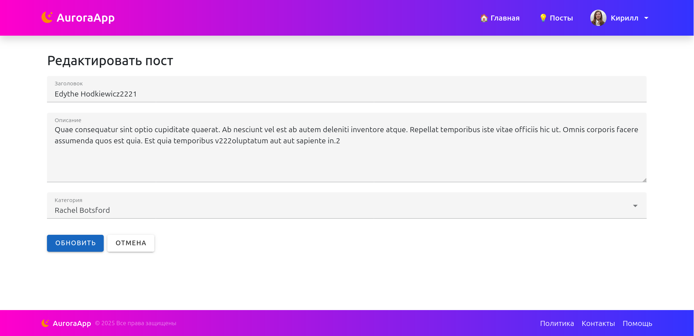

# Описание

Здесь показан пример **простого CRUD-приложения**, созданного с использованием  
**Laravel**, **Inertia.js** и **Vue 3**.

## Возможности
- Поиск по записям
- Сортировка данных
- Пагинация
- Добавление новых записей
- Редактирование существующих
- Реактивный интерфейс без перезагрузки страницы

## Технологии
- **Backend:** Laravel 11
- **Frontend:** Vue 3 + Inertia.js
- **UI:** Bootstrap 5 / Vuetify (в зависимости от реализации)

---

> Этот пример демонстрирует базовую архитектуру и принципы интеграции Laravel и Vue через Inertia.js для создания современного SPA-приложения.

# Настройка

Запуск
```bash
docker compose up -d
```

Устанавливаем зависимости
```bash
docker compose run composer install
docker compose run node npm install
```

Настройка конфига .env
```bash
cp src/.env.example src/.env
```
> Настроить .env под себя

Ключ и миграции
```bash
docker compose run artisan key:generate
docker compose run artisan migrate
```

Наполнение базы тестовыми данными
```bash
docker compose run artisan db:seed
```
# Скриншоты





